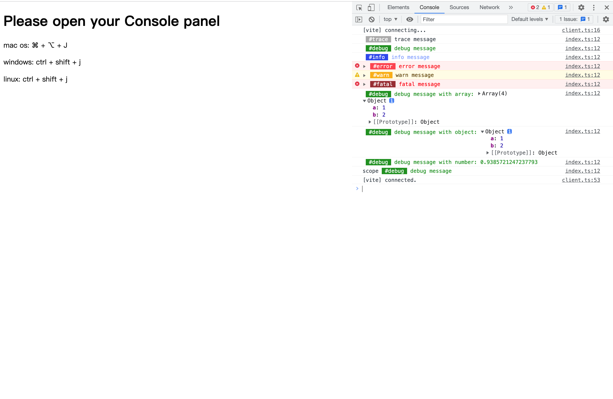

<div align="center">
  
</div>

<h1 align="center">@elonehoo/log</h1>

<p align="center">
  <a href="https://www.npmjs.com/package/@elonehoo/log">
    
  </a>
</p>

## Example

```typescript
import log from '@elonehoo/log'

// levels: 1 - fatal, 2 - info, 3 - error, 4 - warn, 5 - debug, 6 - trace (default is 2)
log.setLevel(6); // the larger the number, the higher the verbosity

// simple logging
log.trace("trace message");
log.debug("debug message");
log.info("info message");
log.error("error message");
log.warn("warn message");
log.fatal("fatal message");

// passing params
log.debug("debug message with array:", [1, 2, 3, 4], {a: 1, b: 2});
log.debug("debug message with object:", {a: 1, b: 2});
log.debug("debug message with number:", Math.random());

// using scopes
const scopedLog = log.scope("scope");
scopedLog.debug("debug message");
```

## Screenshots


